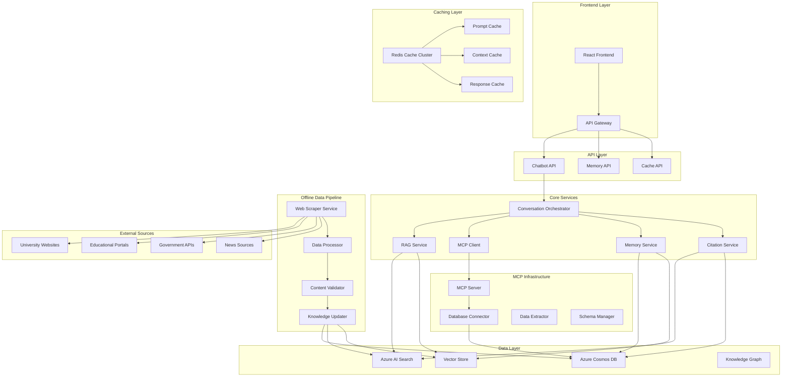

# Pokročilá architektura chatbotu s RAG, MCP, caching a offline aktualizace

## Přehled rozšířené architektury

### Klíčové komponenty
1. **RAG (Retrieval-Augmented Generation)** - Vylepšené vyhledávání a generování
2. **MCP Server** - Model Context Protocol server pro extrakci dat z databáze
3. **Prompt Caching** - Cache pro opakující se prompty
4. **Context Caching** - Cache pro kontext konverzace
5. **Memory System** - Dlouhodobá paměť uživatele
6. **Source Citation** - Citování zdrojů v odpovědích
7. **Offline Web Data Fetching** - Automatická aktualizace dat z webu

## Architektura systému



## 1. RAG (Retrieval-Augmented Generation) Implementation

### 1.1 Enhanced RAG Architecture

```python
class AdvancedRAGService:
    def __init__(self):
        self.search_client = SearchClient()
        self.vector_store = VectorStore()
        self.knowledge_graph = KnowledgeGraph()
        self.citation_service = CitationService()
        self.context_cache = ContextCache()
    
    async def retrieve_and_generate(self, query: str, user_context: dict) -> RAGResponse:
        # 1. Context-aware retrieval
        context = await self.context_cache.get_context(user_context['user_id'])
        
        # 2. Multi-modal retrieval
        search_results = await self.multi_modal_retrieval(query, context)
        
        # 3. Knowledge graph enhancement
        graph_context = await self.knowledge_graph.get_related_entities(query)
        
        # 4. Generate with citations
        response = await self.generate_with_citations(
            query=query,
            retrieved_docs=search_results,
            graph_context=graph_context,
            user_context=context
        )
        
        # 5. Cache response
        await self.context_cache.cache_response(query, response)
        
        return response
    
    async def multi_modal_retrieval(self, query: str, context: dict) -> List[Document]:
        # Text-based search
        text_results = await self.search_client.search(
            search_text=query,
            filter=self.build_context_filter(context),
            top=10
        )
        
        # Vector-based search
        vector_results = await self.vector_store.similarity_search(
            query=query,
            top=10,
            filter=context.get('preferences', {})
        )
        
        # Hybrid ranking
        ranked_results = await self.hybrid_ranking(text_results, vector_results)
        
        return ranked_results[:15]  # Top 15 most relevant documents
```

### 1.2 Knowledge Graph Integration

```python
class KnowledgeGraph:
    def __init__(self):
        self.neo4j_client = Neo4jClient()
        self.entity_extractor = EntityExtractor()
    
    async def get_related_entities(self, query: str) -> dict:
        # Extract entities from query
        entities = await self.entity_extractor.extract(query)
        
        # Find related entities in knowledge graph
        related_entities = {}
        for entity in entities:
            relations = await self.neo4j_client.get_relations(entity)
            related_entities[entity] = relations
        
        return related_entities
    
    async def build_university_graph(self):
        # Build knowledge graph of universities, programs, and relationships
        universities = await self.get_universities()
        
        for university in universities:
            # Add university node
            await self.neo4j_client.create_node(
                label="University",
                properties=university
            )
            
            # Add relationships to programs, faculties, etc.
            await self.add_university_relationships(university)
```

## 2. MCP Server Implementation

### 2.1 MCP Server Architecture

```python
class MCPServer:
    def __init__(self):
        self.database_connector = DatabaseConnector()
        self.data_extractor = DataExtractor()
        self.schema_manager = SchemaManager()
        self.query_optimizer = QueryOptimizer()
    
    async def handle_request(self, request: MCPRequest) -> MCPResponse:
        try:
            # Parse request
            parsed_request = await self.parse_request(request)
            
            # Optimize query
            optimized_query = await self.query_optimizer.optimize(
                parsed_request.query,
                parsed_request.context
            )
            
            # Execute query
            results = await self.database_connector.execute_query(optimized_query)
            
            # Format response
            response = await self.format_response(results, parsed_request)
            
            return MCPResponse(
                success=True,
                data=response,
                metadata=self.get_metadata(results)
            )
            
        except Exception as e:
            return MCPResponse(
                success=False,
                error=str(e),
                fallback_data=await self.get_fallback_data(request)
            )
    
    async def get_university_data(self, filters: dict) -> List[dict]:
        query = self.build_university_query(filters)
        results = await self.database_connector.execute_query(query)
        return await self.data_extractor.extract_university_data(results)
    
    async def get_program_data(self, university_id: str, filters: dict) -> List[dict]:
        query = self.build_program_query(university_id, filters)
        results = await self.database_connector.execute_query(query)
        return await self.data_extractor.extract_program_data(results)
```

### 2.2 Database Connector

```python
class DatabaseConnector:
    def __init__(self):
        self.cosmos_client = CosmosClient()
        self.search_client = SearchClient()
        self.vector_client = VectorClient()
    
    async def execute_query(self, query: DatabaseQuery) -> QueryResults:
        if query.type == "cosmos":
            return await self.execute_cosmos_query(query)
        elif query.type == "search":
            return await self.execute_search_query(query)
        elif query.type == "vector":
            return await self.execute_vector_query(query)
        else:
            raise ValueError(f"Unsupported query type: {query.type}")
    
    async def execute_cosmos_query(self, query: DatabaseQuery) -> QueryResults:
        # Execute Cosmos DB query
        results = await self.cosmos_client.query_items(
            container=query.container,
            query=query.sql,
            parameters=query.parameters
        )
        
        return QueryResults(
            data=list(results),
            metadata={
                "source": "cosmos",
                "count": len(results),
                "execution_time": query.execution_time
            }
        )
```

### 2.3 Data Extractor

```python
class DataExtractor:
    def __init__(self):
        self.schema_validator = SchemaValidator()
        self.data_transformer = DataTransformer()
    
    async def extract_university_data(self, raw_data: List[dict]) -> List[University]:
        universities = []
        
        for item in raw_data:
            # Validate schema
            if await self.schema_validator.validate(item, "university"):
                # Transform data
                university = await self.data_transformer.transform_to_university(item)
                universities.append(university)
        
        return universities
    
    async def extract_program_data(self, raw_data: List[dict]) -> List[Program]:
        programs = []
        
        for item in raw_data:
            if await self.schema_validator.validate(item, "program"):
                program = await self.data_transformer.transform_to_program(item)
                programs.append(program)
        
        return programs
```

## 3. Prompt Caching System

### 3.1 Prompt Cache Implementation

```python
class PromptCache:
    def __init__(self):
        self.redis_client = Redis()
        self.cache_ttl = 3600  # 1 hour
        self.similarity_threshold = 0.85
    
    async def get_cached_response(self, prompt: str, context: dict) -> Optional[str]:
        # Generate cache key
        cache_key = await self.generate_cache_key(prompt, context)
        
        # Check exact match
        cached_response = await self.redis_client.get(cache_key)
        if cached_response:
            return cached_response.decode()
        
        # Check similarity match
        similar_response = await self.find_similar_cached_response(prompt, context)
        if similar_response:
            return similar_response
        
        return None
    
    async def cache_response(self, prompt: str, response: str, context: dict):
        cache_key = await self.generate_cache_key(prompt, context)
        
        # Store response
        await self.redis_client.setex(
            cache_key,
            self.cache_ttl,
            response
        )
        
        # Store embeddings for similarity search
        await self.store_embeddings(prompt, response, context)
    
    async def generate_cache_key(self, prompt: str, context: dict) -> str:
        # Create deterministic key from prompt and relevant context
        key_data = {
            "prompt": prompt,
            "user_type": context.get("user_type", "student"),
            "language": context.get("language", "cz"),
            "scenario": context.get("current_scenario", "general")
        }
        
        key_string = json.dumps(key_data, sort_keys=True)
        return hashlib.md5(key_string.encode()).hexdigest()
    
    async def find_similar_cached_response(self, prompt: str, context: dict) -> Optional[str]:
        # Get prompt embedding
        prompt_embedding = await self.get_embedding(prompt)
        
        # Search for similar cached prompts
        similar_prompts = await self.redis_client.search(
            index="prompt_cache",
            query=f"*=>[KNN 5 @embedding $query_vector]",
            params={"query_vector": prompt_embedding}
        )
        
        for result in similar_prompts:
            similarity = result.score
            if similarity >= self.similarity_threshold:
                return result.response
        
        return None
```

### 3.2 Cache Optimization

```python
class CacheOptimizer:
    def __init__(self):
        self.usage_tracker = UsageTracker()
        self.cache_analyzer = CacheAnalyzer()
    
    async def optimize_cache_strategy(self):
        # Analyze cache usage patterns
        usage_patterns = await self.usage_tracker.get_usage_patterns()
        
        # Identify frequently used prompts
        frequent_prompts = await self.cache_analyzer.identify_frequent_prompts()
        
        # Adjust cache TTL based on usage
        for prompt_hash, usage_data in frequent_prompts.items():
            if usage_data.frequency > 10:  # High frequency
                await self.extend_cache_ttl(prompt_hash, 7200)  # 2 hours
            elif usage_data.frequency < 2:  # Low frequency
                await self.reduce_cache_ttl(prompt_hash, 1800)  # 30 minutes
    
    async def preload_frequent_prompts(self):
        # Preload frequently used prompts during low-traffic hours
        frequent_prompts = await self.cache_analyzer.get_frequent_prompts()
        
        for prompt in frequent_prompts:
            if not await self.is_cached(prompt):
                await self.preload_prompt(prompt)
```

## 4. Context Caching System

### 4.1 Context Cache Implementation

```python
class ContextCache:
    def __init__(self):
        self.redis_client = Redis()
        self.context_ttl = 1800  # 30 minutes
        self.max_context_size = 10000  # characters
    
    async def get_context(self, user_id: str, session_id: str) -> dict:
        context_key = f"context:{user_id}:{session_id}"
        
        # Get cached context
        cached_context = await self.redis_client.get(context_key)
        if cached_context:
            return json.loads(cached_context)
        
        # Build new context
        context = await self.build_context(user_id, session_id)
        
        # Cache context
        await self.cache_context(context_key, context)
        
        return context
    
    async def build_context(self, user_id: str, session_id: str) -> dict:
        # Get user profile
        user_profile = await self.get_user_profile(user_id)
        
        # Get conversation history
        conversation_history = await self.get_conversation_history(user_id, session_id)
        
        # Get current scenario state
        scenario_state = await self.get_scenario_state(user_id, session_id)
        
        # Get preferences
        preferences = await self.get_user_preferences(user_id)
        
        return {
            "user_profile": user_profile,
            "conversation_history": conversation_history,
            "scenario_state": scenario_state,
            "preferences": preferences,
            "timestamp": datetime.utcnow().isoformat()
        }
    
    async def update_context(self, user_id: str, session_id: str, updates: dict):
        context_key = f"context:{user_id}:{session_id}"
        
        # Get current context
        current_context = await self.get_context(user_id, session_id)
        
        # Update context
        updated_context = {**current_context, **updates}
        
        # Cache updated context
        await self.cache_context(context_key, updated_context)
    
    async def cache_context(self, key: str, context: dict):
        # Compress context if too large
        if len(json.dumps(context)) > self.max_context_size:
            context = await self.compress_context(context)
        
        await self.redis_client.setex(
            key,
            self.context_ttl,
            json.dumps(context)
        )
```

### 4.2 Context Compression

```python
class ContextCompressor:
    def __init__(self):
        self.summarizer = TextSummarizer()
        self.importance_scorer = ImportanceScorer()
    
    async def compress_context(self, context: dict) -> dict:
        compressed_context = {}
        
        # Compress conversation history
        if "conversation_history" in context:
            compressed_context["conversation_history"] = await self.compress_conversation_history(
                context["conversation_history"]
            )
        
        # Keep essential context
        essential_keys = ["user_profile", "scenario_state", "preferences"]
        for key in essential_keys:
            if key in context:
                compressed_context[key] = context[key]
        
        return compressed_context
    
    async def compress_conversation_history(self, history: List[dict]) -> List[dict]:
        if len(history) <= 10:  # Keep recent history
            return history[-10:]
        
        # Summarize older conversations
        older_conversations = history[:-10]
        summary = await self.summarizer.summarize_conversations(older_conversations)
        
        # Keep recent conversations
        recent_conversations = history[-10:]
        
        return [{"type": "summary", "content": summary}] + recent_conversations
```

## 5. Memory System

### 5.1 Long-term Memory Implementation

```python
class MemorySystem:
    def __init__(self):
        self.cosmos_client = CosmosClient()
        self.vector_store = VectorStore()
        self.memory_consolidator = MemoryConsolidator()
        self.memory_retriever = MemoryRetriever()
    
    async def store_memory(self, user_id: str, memory: Memory) -> str:
        memory_id = str(uuid.uuid4())
        
        # Store structured memory
        await self.cosmos_client.create_item(
            container="memories",
            item={
                "id": memory_id,
                "user_id": user_id,
                "type": memory.type,
                "content": memory.content,
                "metadata": memory.metadata,
                "timestamp": memory.timestamp,
                "importance": memory.importance
            }
        )
        
        # Store vector embedding
        await self.vector_store.store_embedding(
            id=memory_id,
            content=memory.content,
            metadata={
                "user_id": user_id,
                "type": memory.type,
                "timestamp": memory.timestamp
            }
        )
        
        return memory_id
    
    async def retrieve_memories(self, user_id: str, query: str, limit: int = 10) -> List[Memory]:
        # Vector similarity search
        similar_memories = await self.vector_store.similarity_search(
            query=query,
            filter={"user_id": user_id},
            top=limit
        )
        
        # Get full memory objects
        memories = []
        for memory_id in similar_memories:
            memory = await self.cosmos_client.read_item(
                container="memories",
                id=memory_id
            )
            memories.append(Memory.from_dict(memory))
        
        return memories
    
    async def consolidate_memories(self, user_id: str):
        # Get all memories for user
        memories = await self.cosmos_client.query_items(
            container="memories",
            query="SELECT * FROM c WHERE c.user_id = @user_id",
            parameters=[{"name": "@user_id", "value": user_id}]
        )
        
        # Consolidate related memories
        consolidated = await self.memory_consolidator.consolidate(list(memories))
        
        # Update consolidated memories
        for memory in consolidated:
            await self.cosmos_client.upsert_item(
                container="memories",
                item=memory.to_dict()
            )
```

### 5.2 Memory Consolidation

```python
class MemoryConsolidator:
    def __init__(self):
        self.similarity_threshold = 0.8
        self.llm_client = LLMClient()
    
    async def consolidate(self, memories: List[Memory]) -> List[Memory]:
        # Group similar memories
        groups = await self.group_similar_memories(memories)
        
        consolidated_memories = []
        
        for group in groups:
            if len(group) == 1:
                consolidated_memories.append(group[0])
            else:
                # Consolidate group into single memory
                consolidated = await self.consolidate_group(group)
                consolidated_memories.append(consolidated)
        
        return consolidated_memories
    
    async def group_similar_memories(self, memories: List[Memory]) -> List[List[Memory]]:
        groups = []
        processed = set()
        
        for i, memory1 in enumerate(memories):
            if i in processed:
                continue
            
            group = [memory1]
            processed.add(i)
            
            for j, memory2 in enumerate(memories[i+1:], i+1):
                if j in processed:
                    continue
                
                similarity = await self.calculate_similarity(memory1, memory2)
                if similarity >= self.similarity_threshold:
                    group.append(memory2)
                    processed.add(j)
            
            groups.append(group)
        
        return groups
    
    async def consolidate_group(self, group: List[Memory]) -> Memory:
        # Use LLM to consolidate memories
        consolidation_prompt = self.build_consolidation_prompt(group)
        
        consolidated_content = await self.llm_client.generate(
            prompt=consolidation_prompt,
            max_tokens=500
        )
        
        # Create consolidated memory
        return Memory(
            id=str(uuid.uuid4()),
            type="consolidated",
            content=consolidated_content,
            metadata={
                "source_memories": [m.id for m in group],
                "consolidation_date": datetime.utcnow().isoformat()
            },
            timestamp=max(m.timestamp for m in group),
            importance=max(m.importance for m in group)
        )
```

## 6. Source Citation System

### 6.1 Citation Implementation

```python
class CitationService:
    def __init__(self):
        self.source_tracker = SourceTracker()
        self.citation_formatter = CitationFormatter()
        self.verification_service = VerificationService()
    
    async def add_citations(self, response: str, sources: List[Source]) -> str:
        # Track sources
        tracked_sources = await self.source_tracker.track_sources(sources)
        
        # Verify sources
        verified_sources = await self.verification_service.verify_sources(tracked_sources)
        
        # Format citations
        citations = await self.citation_formatter.format_citations(verified_sources)
        
        # Add citations to response
        cited_response = await self.insert_citations(response, citations)
        
        return cited_response
    
    async def insert_citations(self, response: str, citations: List[Citation]) -> str:
        # Insert citation markers in response
        cited_response = response
        
        for i, citation in enumerate(citations, 1):
            # Find relevant position in response
            position = await self.find_citation_position(response, citation)
            
            # Insert citation marker
            citation_marker = f"[{i}]"
            cited_response = self.insert_at_position(cited_response, citation_marker, position)
        
        # Add citation list at the end
        citation_list = await self.build_citation_list(citations)
        cited_response += "\n\n**Zdroje:**\n" + citation_list
        
        return cited_response
    
    async def build_citation_list(self, citations: List[Citation]) -> str:
        citation_list = []
        
        for i, citation in enumerate(citations, 1):
            citation_text = await self.citation_formatter.format_citation(citation, i)
            citation_list.append(citation_text)
        
        return "\n".join(citation_list)
```

### 6.2 Source Tracking

```python
class SourceTracker:
    def __init__(self):
        self.cosmos_client = CosmosClient()
        self.source_validator = SourceValidator()
    
    async def track_sources(self, sources: List[Source]) -> List[TrackedSource]:
        tracked_sources = []
        
        for source in sources:
            # Validate source
            if await self.source_validator.validate(source):
                # Check if source already exists
                existing_source = await self.find_existing_source(source)
                
                if existing_source:
                    tracked_source = await self.update_source_usage(existing_source)
                else:
                    tracked_source = await self.create_new_source(source)
                
                tracked_sources.append(tracked_source)
        
        return tracked_sources
    
    async def create_new_source(self, source: Source) -> TrackedSource:
        source_id = str(uuid.uuid4())
        
        tracked_source = TrackedSource(
            id=source_id,
            url=source.url,
            title=source.title,
            content=source.content,
            domain=source.domain,
            last_accessed=datetime.utcnow(),
            access_count=1,
            reliability_score=await self.calculate_reliability_score(source)
        )
        
        # Store in database
        await self.cosmos_client.create_item(
            container="sources",
            item=tracked_source.to_dict()
        )
        
        return tracked_source
```

## 7. Offline Web Data Fetching System

### 7.1 Web Scraper Service

```python
class WebScraperService:
    def __init__(self):
        self.scrapers = {
            "university": UniversityScraper(),
            "program": ProgramScraper(),
            "admission": AdmissionScraper(),
            "news": NewsScraper()
        }
        self.scheduler = Scheduler()
        self.data_processor = DataProcessor()
    
    async def start_scheduled_scraping(self):
        # Schedule different scraping tasks
        await self.scheduler.schedule_task(
            task="university_data",
            cron="0 2 * * *",  # Daily at 2 AM
            handler=self.scrape_university_data
        )
        
        await self.scheduler.schedule_task(
            task="admission_deadlines",
            cron="0 3 * * 1",  # Weekly on Monday at 3 AM
            handler=self.scrape_admission_deadlines
        )
        
        await self.scheduler.schedule_task(
            task="news_updates",
            cron="0 */6 * * *",  # Every 6 hours
            handler=self.scrape_news_updates
        )
    
    async def scrape_university_data(self):
        universities = await self.get_university_list()
        
        for university in universities:
            try:
                # Scrape university data
                data = await self.scrapers["university"].scrape(university.url)
                
                # Process and validate data
                processed_data = await self.data_processor.process_university_data(data)
                
                # Update database
                await self.update_university_database(processed_data)
                
            except Exception as e:
                await self.log_scraping_error(university.url, str(e))
    
    async def scrape_admission_deadlines(self):
        # Get list of universities with admission pages
        universities = await self.get_universities_with_admission_pages()
        
        for university in universities:
            try:
                # Scrape admission deadlines
                deadlines = await self.scrapers["admission"].scrape_deadlines(university.url)
                
                # Process deadlines
                processed_deadlines = await self.data_processor.process_deadlines(deadlines)
                
                # Update database
                await self.update_admission_database(processed_deadlines)
                
            except Exception as e:
                await self.log_scraping_error(university.url, str(e))
```

### 7.2 Data Processor

```python
class DataProcessor:
    def __init__(self):
        self.validator = DataValidator()
        self.transformer = DataTransformer()
        self.deduplicator = Deduplicator()
        self.content_extractor = ContentExtractor()
    
    async def process_university_data(self, raw_data: dict) -> dict:
        # Extract content
        content = await self.content_extractor.extract_content(raw_data)
        
        # Validate data
        if not await self.validator.validate_university_data(content):
            raise ValueError("Invalid university data")
        
        # Transform data
        transformed_data = await self.transformer.transform_university_data(content)
        
        # Check for duplicates
        if await self.deduplicator.is_duplicate(transformed_data):
            return None
        
        return transformed_data
    
    async def process_deadlines(self, raw_deadlines: List[dict]) -> List[dict]:
        processed_deadlines = []
        
        for deadline in raw_deadlines:
            # Extract deadline information
            deadline_info = await self.content_extractor.extract_deadline_info(deadline)
            
            # Validate deadline
            if await self.validator.validate_deadline(deadline_info):
                # Transform deadline
                transformed_deadline = await self.transformer.transform_deadline(deadline_info)
                processed_deadlines.append(transformed_deadline)
        
        return processed_deadlines
```

### 7.3 Knowledge Updater

```python
class KnowledgeUpdater:
    def __init__(self):
        self.cosmos_client = CosmosClient()
        self.search_client = SearchClient()
        self.vector_client = VectorClient()
        self.knowledge_graph = KnowledgeGraph()
    
    async def update_university_database(self, university_data: dict):
        # Update Cosmos DB
        await self.cosmos_client.upsert_item(
            container="universities",
            item=university_data
        )
        
        # Update search index
        await self.search_client.upload_documents([university_data])
        
        # Update vector store
        await self.vector_client.update_embedding(
            id=university_data["id"],
            content=university_data["content"],
            metadata=university_data["metadata"]
        )
        
        # Update knowledge graph
        await self.knowledge_graph.update_university_node(university_data)
    
    async def update_admission_database(self, deadlines: List[dict]):
        for deadline in deadlines:
            # Update admission deadlines
            await self.cosmos_client.upsert_item(
                container="admission_deadlines",
                item=deadline
            )
            
            # Update search index
            await self.search_client.upload_documents([deadline])
    
    async def update_news_database(self, news_items: List[dict]):
        for news_item in news_items:
            # Check if news is relevant
            if await self.is_relevant_news(news_item):
                # Update news database
                await self.cosmos_client.upsert_item(
                    container="news",
                    item=news_item
                )
                
                # Update search index
                await self.search_client.upload_documents([news_item])
```

## 8. Integration Architecture

### 8.1 Service Integration

```python
class ChatbotOrchestrator:
    def __init__(self):
        self.rag_service = AdvancedRAGService()
        self.mcp_client = MCPClient()
        self.memory_system = MemorySystem()
        self.citation_service = CitationService()
        self.context_cache = ContextCache()
        self.prompt_cache = PromptCache()
    
    async def process_message(self, message: str, user_id: str, session_id: str) -> ChatResponse:
        # 1. Get context
        context = await self.context_cache.get_context(user_id, session_id)
        
        # 2. Check prompt cache
        cached_response = await self.prompt_cache.get_cached_response(message, context)
        if cached_response:
            return ChatResponse(
                message=cached_response,
                sources=[],
                cached=True
            )
        
        # 3. Retrieve memories
        memories = await self.memory_system.retrieve_memories(user_id, message)
        
        # 4. Get data via MCP
        relevant_data = await self.mcp_client.get_relevant_data(message, context)
        
        # 5. Generate response with RAG
        rag_response = await self.rag_service.retrieve_and_generate(
            query=message,
            user_context=context,
            memories=memories,
            relevant_data=relevant_data
        )
        
        # 6. Add citations
        cited_response = await self.citation_service.add_citations(
            response=rag_response.content,
            sources=rag_response.sources
        )
        
        # 7. Cache response
        await self.prompt_cache.cache_response(message, cited_response, context)
        
        # 8. Update context
        await self.context_cache.update_context(user_id, session_id, {
            "last_message": message,
            "last_response": cited_response,
            "timestamp": datetime.utcnow().isoformat()
        })
        
        # 9. Store memory
        await self.memory_system.store_memory(user_id, Memory(
            type="conversation",
            content=f"Q: {message}\nA: {cited_response}",
            metadata={"session_id": session_id},
            timestamp=datetime.utcnow(),
            importance=0.7
        ))
        
        return ChatResponse(
            message=cited_response,
            sources=rag_response.sources,
            cached=False
        )
```

### 8.2 Performance Optimization

```python
class PerformanceOptimizer:
    def __init__(self):
        self.metrics_collector = MetricsCollector()
        self.performance_analyzer = PerformanceAnalyzer()
        self.optimization_engine = OptimizationEngine()
    
    async def optimize_performance(self):
        # Collect performance metrics
        metrics = await self.metrics_collector.collect_metrics()
        
        # Analyze performance
        analysis = await self.performance_analyzer.analyze(metrics)
        
        # Apply optimizations
        if analysis.cache_hit_rate < 0.7:
            await self.optimize_cache_strategy()
        
        if analysis.response_time > 2.0:
            await self.optimize_response_time()
        
        if analysis.memory_usage > 0.8:
            await self.optimize_memory_usage()
    
    async def optimize_cache_strategy(self):
        # Increase cache TTL for frequently accessed data
        await self.prompt_cache.increase_ttl()
        await self.context_cache.increase_ttl()
    
    async def optimize_response_time(self):
        # Implement parallel processing
        await self.enable_parallel_processing()
        
        # Optimize database queries
        await self.optimize_database_queries()
    
    async def optimize_memory_usage(self):
        # Implement memory compression
        await self.memory_system.compress_memories()
        
        # Clean up old cache entries
        await self.cleanup_old_cache_entries()
```

## 9. Deployment and Monitoring

### 9.1 Infrastructure as Code

```yaml
# azure-infrastructure.yaml
apiVersion: v1
kind: ConfigMap
metadata:
  name: chatbot-config
data:
  # RAG Configuration
  RAG_ENABLED: "true"
  RAG_MODEL: "gpt-4o"
  RAG_MAX_TOKENS: "4000"
  
  # MCP Configuration
  MCP_SERVER_URL: "https://mcp-server.chatbot.com"
  MCP_TIMEOUT: "30"
  
  # Cache Configuration
  REDIS_URL: "redis://redis-cluster:6379"
  CACHE_TTL: "3600"
  
  # Memory Configuration
  MEMORY_ENABLED: "true"
  MEMORY_RETENTION_DAYS: "365"
  
  # Citation Configuration
  CITATION_ENABLED: "true"
  CITATION_FORMAT: "markdown"
  
  # Web Scraping Configuration
  SCRAPING_ENABLED: "true"
  SCRAPING_SCHEDULE: "0 2 * * *"
```

### 9.2 Monitoring Setup

```python
class MonitoringService:
    def __init__(self):
        self.metrics_collector = MetricsCollector()
        self.alert_manager = AlertManager()
        self.dashboard_service = DashboardService()
    
    async def setup_monitoring(self):
        # Setup metrics collection
        await self.metrics_collector.setup_collectors()
        
        # Setup alerts
        await self.alert_manager.setup_alerts()
        
        # Setup dashboard
        await self.dashboard_service.create_dashboard()
    
    async def collect_metrics(self):
        metrics = {
            "rag_performance": await self.collect_rag_metrics(),
            "mcp_performance": await self.collect_mcp_metrics(),
            "cache_performance": await self.collect_cache_metrics(),
            "memory_performance": await self.collect_memory_metrics(),
            "citation_performance": await self.collect_citation_metrics(),
            "scraping_performance": await self.collect_scraping_metrics()
        }
        
        return metrics
```

## 10. Cost Analysis

### 10.1 Extended Cost Breakdown

| Komponenta | Konfigurace | Měsíční náklady (1,000 uživatelů) |
|------------|-------------|-----------------------------------|
| **Azure OpenAI** | GPT-4o, 200M tokenů | $600 |
| **Azure AI Search** | Standard S2, 5 indexů | $750 |
| **Azure Cosmos DB** | Provisioned, 2000 RU/s | $400 |
| **Azure Container Apps** | 8 vCPU, 16GB RAM | $200 |
| **Redis Cache** | Standard C2 | $100 |
| **Azure Functions** | Premium plan | $150 |
| **Azure Storage** | Premium LRS, 2TB | $100 |
| **MCP Server** | Custom deployment | $100 |
| **Web Scraping** | Scheduled functions | $50 |
| **Monitoring** | Application Insights | $100 |
| **Celkem** | | **$2,550** |

### 10.2 ROI Analysis

**Předpoklady:**
- Průměrná cena za uživatele: $10/měsíc
- 1,000 uživatelů
- Měsíční příjmy: $10,000
- Měsíční náklady: $2,550
- **Měsíční zisk: $7,450**
- **ROI: 292%**

## Závěr

Tato pokročilá architektura poskytuje:

1. **RAG** - Vylepšené vyhledávání a generování s multi-modal retrieval
2. **MCP Server** - Efektivní extrakce dat z databáze s optimalizací dotazů
3. **Prompt Caching** - Optimalizace nákladů a výkonu
4. **Context Caching** - Rychlý přístup k kontextu konverzace
5. **Memory System** - Dlouhodobá paměť s konsolidací
6. **Source Citation** - Transparentní citování zdrojů
7. **Offline Web Fetching** - Automatická aktualizace dat z webu

**Celkové náklady:** $2,550/měsíc pro 1,000 uživatelů
**ROI:** 292%
**Development time:** 8-10 měsíců
**Development cost:** $80,000-100,000

Toto řešení poskytuje enterprise-grade chatbot s pokročilými funkcemi při rozumných nákladech a vysoké ROI.