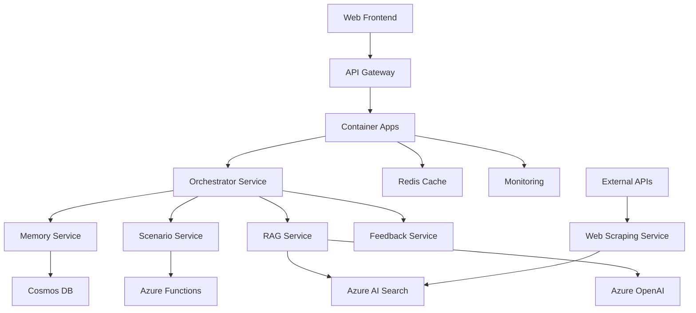

# Technický návrh implementace chatbotu pro výběr vysoké školy

## Architektura doporučeného řešení (Střední řešení)

### 1. Systémová architektura



### 2. Komponenty systému

#### 2.1 Frontend (React + TypeScript)
```typescript
// Komponenty
- ChatInterface: Hlavní chat rozhraní
- ScenarioWizard: Průvodce scénáři
- FeedbackModal: Zpětná vazba
- LanguageSelector: Výběr jazyka
- MemoryPanel: Zobrazení paměti uživatele

// State management
- ChatState: Stav konverzace
- UserMemory: Dlouhodobá paměť
- ScenarioState: Stav scénáře
- LanguageState: Jazykové nastavení
```

#### 2.2 Backend Services

**Orchestrator Service (Python + FastAPI)**
```python
class ChatOrchestrator:
    def __init__(self):
        self.memory_service = MemoryService()
        self.scenario_service = ScenarioService()
        self.rag_service = RAGService()
        self.feedback_service = FeedbackService()
    
    async def process_message(self, message: str, user_id: str, session_id: str):
        # 1. Načtení kontextu z paměti
        context = await self.memory_service.get_context(user_id)
        
        # 2. Detekce jazyka
        language = self.detect_language(message)
        
        # 3. Routing na základě kontextu
        if self.is_scenario_context(context):
            return await self.scenario_service.process(message, context)
        else:
            return await self.rag_service.process(message, context)
        
        # 4. Uložení do paměti
        await self.memory_service.store_interaction(user_id, message, response)
```

**Memory Service (Python + Cosmos DB)**
```python
class MemoryService:
    def __init__(self):
        self.cosmos_client = CosmosClient()
        self.vector_store = VectorStore()
    
    async def get_context(self, user_id: str) -> UserContext:
        # Strukturovaná data z Cosmos DB
        structured_data = await self.cosmos_client.get_user_data(user_id)
        
        # Vektorové embeddings pro podobnost
        vector_context = await self.vector_store.get_similar_contexts(user_id)
        
        return UserContext(structured_data, vector_context)
    
    async def store_interaction(self, user_id: str, message: str, response: str):
        # Uložení do Cosmos DB
        await self.cosmos_client.store_interaction(user_id, message, response)
        
        # Uložení embeddings
        await self.vector_store.store_embeddings(user_id, message, response)
```

**Scenario Service (Python + Azure Functions)**
```python
class ScenarioService:
    def __init__(self):
        self.scenarios = {
            "career_choice": CareerChoiceScenario(),
            "university_selection": UniversitySelectionScenario(),
            "field_comparison": FieldComparisonScenario()
        }
    
    async def process(self, message: str, context: UserContext) -> str:
        current_scenario = context.current_scenario
        scenario = self.scenarios[current_scenario]
        
        # Dynamické zpracování scénáře
        return await scenario.process_step(message, context)
```

### 3. Databázový návrh

#### 3.1 Cosmos DB Collections

**Users Collection**
```json
{
  "id": "user_123",
  "preferences": {
    "interests": ["IT", "Business"],
    "location_preference": "Prague",
    "budget_range": "low"
  },
  "interaction_history": [
    {
      "timestamp": "2024-01-15T10:30:00Z",
      "message": "Chci studovat IT",
      "response": "Doporučuji VŠE nebo ČVUT",
      "scenario": "career_choice",
      "step": 2
    }
  ],
  "scenario_progress": {
    "career_choice": {
      "current_step": 3,
      "completed": false,
      "data": {...}
    }
  }
}
```

**Universities Collection**
```json
{
  "id": "university_001",
  "name": "České vysoké učení technické v Praze",
  "faculties": [
    {
      "name": "Fakulta informačních technologií",
      "programs": [
        {
          "name": "Informatika",
          "duration": 3,
          "language": "cz",
          "requirements": {...},
          "subjects": [...]
        }
      ]
    }
  ],
  "admission_info": {
    "deadlines": [...],
    "requirements": [...],
    "open_days": [...]
  }
}
```

#### 3.2 Azure AI Search Index

```json
{
  "name": "universities-index",
  "fields": [
    {
      "name": "id",
      "type": "Edm.String",
      "key": true
    },
    {
      "name": "content",
      "type": "Edm.String",
      "searchable": true,
      "analyzer": "czech"
    },
    {
      "name": "embedding",
      "type": "Collection(Edm.Single)",
      "dimensions": 1536
    },
    {
      "name": "metadata",
      "type": "Edm.ComplexType",
      "fields": [
        {"name": "university_name", "type": "Edm.String"},
        {"name": "faculty_name", "type": "Edm.String"},
        {"name": "program_name", "type": "Edm.String"},
        {"name": "language", "type": "Edm.String"}
      ]
    }
  ]
}
```

### 4. Implementace dlouhodobé paměti

#### 4.1 Strukturovaná paměť (Cosmos DB)
```python
class StructuredMemory:
    def __init__(self):
        self.cosmos_client = CosmosClient()
    
    async def store_user_preference(self, user_id: str, preference: dict):
        await self.cosmos_client.upsert_item(
            container="users",
            item={
                "id": user_id,
                "preferences": preference,
                "last_updated": datetime.utcnow()
            }
        )
    
    async def get_user_profile(self, user_id: str) -> UserProfile:
        item = await self.cosmos_client.read_item(
            container="users",
            id=user_id
        )
        return UserProfile.from_dict(item)
```

#### 4.2 Vektorová paměť (Azure AI Search)
```python
class VectorMemory:
    def __init__(self):
        self.search_client = SearchClient()
        self.embedding_client = EmbeddingClient()
    
    async def store_conversation(self, user_id: str, conversation: Conversation):
        # Vytvoření embeddings
        embedding = await self.embedding_client.create_embedding(
            conversation.content
        )
        
        # Uložení do search indexu
        await self.search_client.upload_documents([{
            "id": f"{user_id}_{conversation.id}",
            "user_id": user_id,
            "content": conversation.content,
            "embedding": embedding,
            "timestamp": conversation.timestamp,
            "scenario": conversation.scenario
        }])
    
    async def find_similar_conversations(self, user_id: str, query: str, limit: int = 5):
        # Vytvoření embedding pro query
        query_embedding = await self.embedding_client.create_embedding(query)
        
        # Vyhledání podobných konverzací
        results = await self.search_client.search(
            search_text="*",
            vector_queries=[{
                "vector": query_embedding,
                "k": limit,
                "fields": "embedding"
            }],
            filter=f"user_id eq '{user_id}'"
        )
        
        return [result for result in results]
```

### 5. Implementace dynamických scénářů

#### 5.1 Scénář výběru kariéry
```python
class CareerChoiceScenario:
    def __init__(self):
        self.steps = [
            "welcome",
            "interest_assessment",
            "skill_evaluation",
            "personality_analysis",
            "recommendation"
        ]
        self.current_step = 0
    
    async def process_step(self, message: str, context: UserContext) -> str:
        step_handler = getattr(self, f"handle_{self.steps[self.current_step]}")
        response = await step_handler(message, context)
        
        # Aktualizace kontextu
        context.scenario_data[self.steps[self.current_step]] = {
            "user_input": message,
            "response": response,
            "timestamp": datetime.utcnow()
        }
        
        # Pokrok na další krok
        if self.should_advance_step(message, context):
            self.current_step += 1
        
        return response
    
    async def handle_interest_assessment(self, message: str, context: UserContext) -> str:
        # Analýza zájmů pomocí LLM
        interests = await self.extract_interests(message)
        
        # Uložení do kontextu
        context.user_preferences["interests"] = interests
        
        return f"Vidím, že vás zajímá {', '.join(interests)}. Jaké předměty vás bavily na střední škole?"
```

#### 5.2 Scénář výběru vysoké školy
```python
class UniversitySelectionScenario:
    def __init__(self):
        self.criteria = [
            "location",
            "program_quality",
            "admission_difficulty",
            "cost",
            "reputation"
        ]
    
    async def process_step(self, message: str, context: UserContext) -> str:
        # Analýza kritérií uživatele
        criteria = await self.extract_criteria(message, context)
        
        # Vyhledání vhodných škol
        universities = await self.search_universities(criteria, context)
        
        # Generování doporučení
        recommendation = await self.generate_recommendation(universities, context)
        
        return recommendation
```

### 6. Optimalizace tokenů a nákladů

#### 6.1 Prompt Caching
```python
class PromptCache:
    def __init__(self):
        self.redis_client = Redis()
        self.cache_ttl = 3600  # 1 hodina
    
    async def get_cached_response(self, prompt_hash: str) -> Optional[str]:
        cached = await self.redis_client.get(f"prompt:{prompt_hash}")
        return cached.decode() if cached else None
    
    async def cache_response(self, prompt_hash: str, response: str):
        await self.redis_client.setex(
            f"prompt:{prompt_hash}",
            self.cache_ttl,
            response
        )
    
    def hash_prompt(self, prompt: str, context: dict) -> str:
        # Vytvoření hash z promptu a kontextu
        content = f"{prompt}:{json.dumps(context, sort_keys=True)}"
        return hashlib.md5(content.encode()).hexdigest()
```

#### 6.2 Token Monitoring
```python
class TokenMonitor:
    def __init__(self):
        self.usage_tracker = UsageTracker()
    
    async def track_usage(self, user_id: str, tokens_used: int, cost: float):
        await self.usage_tracker.record_usage(
            user_id=user_id,
            tokens=tokens_used,
            cost=cost,
            timestamp=datetime.utcnow()
        )
    
    async def check_limits(self, user_id: str) -> bool:
        monthly_usage = await self.usage_tracker.get_monthly_usage(user_id)
        return monthly_usage.tokens < MONTHLY_TOKEN_LIMIT
```

### 7. Implementace zpětné vazby

#### 7.1 Feedback Collection
```python
class FeedbackService:
    def __init__(self):
        self.cosmos_client = CosmosClient()
    
    async def collect_feedback(self, user_id: str, session_id: str, feedback: Feedback):
        await self.cosmos_client.create_item(
            container="feedback",
            item={
                "id": f"{user_id}_{session_id}_{datetime.utcnow().isoformat()}",
                "user_id": user_id,
                "session_id": session_id,
                "rating": feedback.rating,
                "comments": feedback.comments,
                "timestamp": datetime.utcnow(),
                "conversation_summary": feedback.conversation_summary
            }
        )
    
    async def analyze_feedback_trends(self) -> FeedbackAnalysis:
        # Analýza trendů zpětné vazby
        feedback_data = await self.cosmos_client.query_items(
            container="feedback",
            query="SELECT * FROM c WHERE c.timestamp >= @start_date",
            parameters=[{"name": "@start_date", "value": datetime.utcnow() - timedelta(days=30)}]
        )
        
        return self.analyze_feedback_data(feedback_data)
```

### 8. Monitoring a analytika

#### 8.1 Application Insights Integration
```python
class AnalyticsService:
    def __init__(self):
        self.app_insights = ApplicationInsights()
    
    async def track_conversation_start(self, user_id: str, session_id: str):
        await self.app_insights.track_event(
            name="conversation_started",
            properties={
                "user_id": user_id,
                "session_id": session_id,
                "timestamp": datetime.utcnow().isoformat()
            }
        )
    
    async def track_conversation_completion(self, user_id: str, session_id: str, duration: int):
        await self.app_insights.track_event(
            name="conversation_completed",
            properties={
                "user_id": user_id,
                "session_id": session_id,
                "duration_seconds": duration,
                "timestamp": datetime.utcnow().isoformat()
            }
        )
```

### 9. Bezpečnost a compliance

#### 9.1 PII Protection
```python
class PIIProtection:
    def __init__(self):
        self.pii_client = PIIClient()
    
    async def redact_pii(self, text: str) -> str:
        result = await self.pii_client.recognize_pii_entities([text])
        redacted_text = text
        
        for entity in result[0].entities:
            redacted_text = redacted_text.replace(
                entity.text,
                f"[{entity.category}]"
            )
        
        return redacted_text
    
    async def reconstruct_pii(self, text: str, user_id: str) -> str:
        # Rekonstrukce PII pro uživatele
        pii_mapping = await self.get_pii_mapping(user_id)
        reconstructed_text = text
        
        for placeholder, original in pii_mapping.items():
            reconstructed_text = reconstructed_text.replace(placeholder, original)
        
        return reconstructed_text
```

### 10. Deployment a DevOps

#### 10.1 Azure DevOps Pipeline
```yaml
trigger:
- main

pool:
  vmImage: 'ubuntu-latest'

variables:
  azureSubscription: 'your-subscription'
  resourceGroupName: 'chatbot-rg'
  containerRegistry: 'your-registry'

stages:
- stage: Build
  jobs:
  - job: BuildJob
    steps:
    - task: Docker@2
      inputs:
        command: 'build'
        dockerfile: 'src/Dockerfile'
        tags: '$(Build.BuildId)'
    
    - task: Docker@2
      inputs:
        command: 'push'
        tags: '$(Build.BuildId)'

- stage: Deploy
  jobs:
  - deployment: DeployJob
    environment: 'production'
    strategy:
      runOnce:
        deploy:
          steps:
          - task: AzureContainerApps@1
            inputs:
              azureSubscription: '$(azureSubscription)'
              resourceGroupName: '$(resourceGroupName)'
              containerAppName: 'chatbot-app'
              imageToDeploy: '$(containerRegistry)/chatbot:$(Build.BuildId)'
```

Tento technický návrh poskytuje solidní základ pro implementaci středního řešení chatbotu s možností budoucího rozšíření na pokročilejší verze.